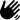
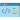
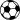

Hi, I'm Aboubacar DIAWARA 

## Who am I?
---
I'am a second year computer science student

## Skills
---
### Web

## Follow me
---

## Hobbies
<ul>
    <li>
        
        coding
    </li>
    <li>
        
        sport especially football
    </li>
    <li>
        
        Art (Music, books)
    </li>
</ul>
